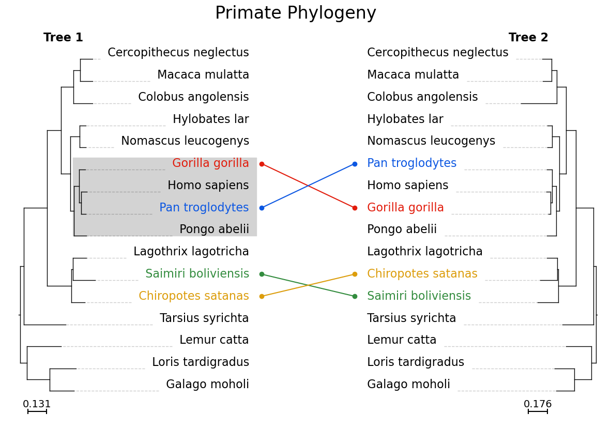
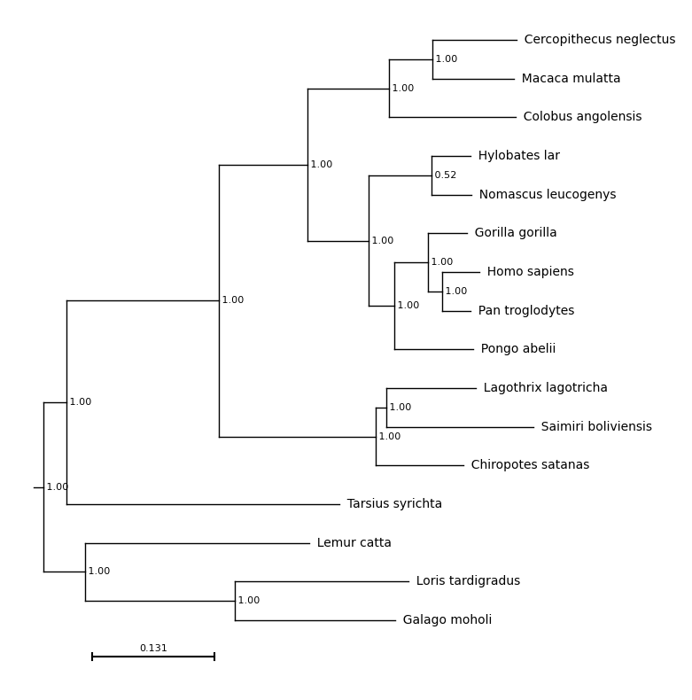
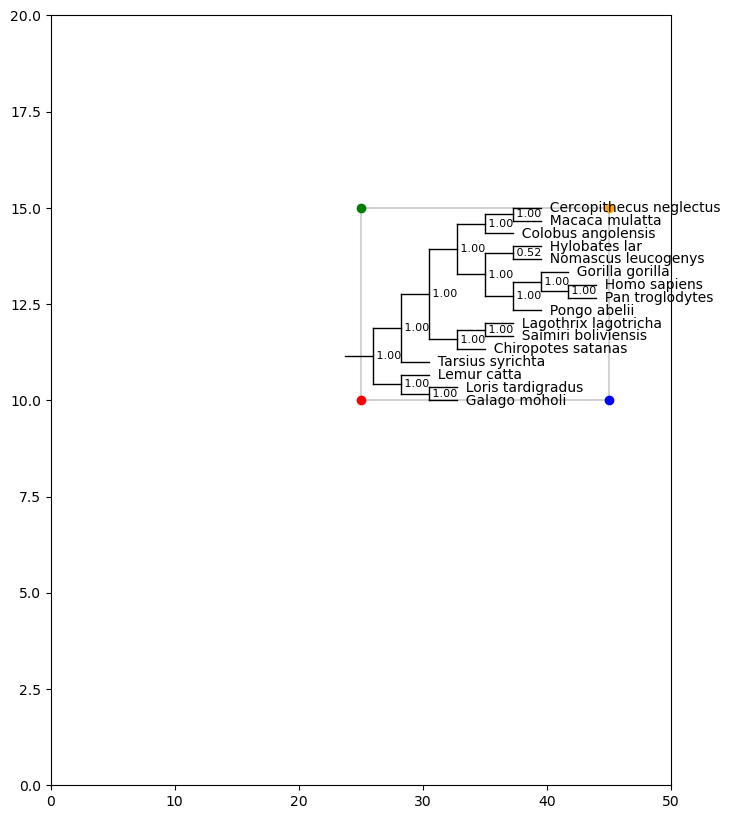
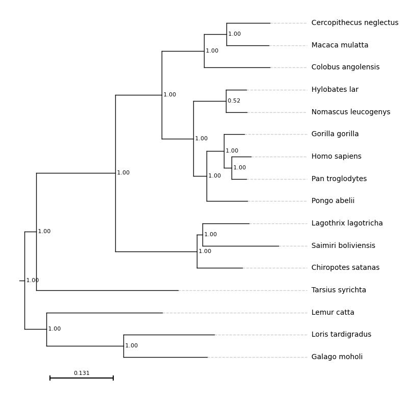
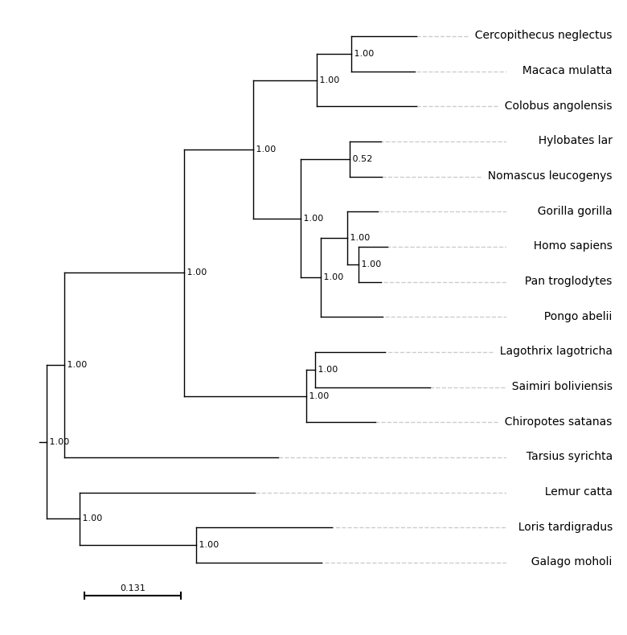
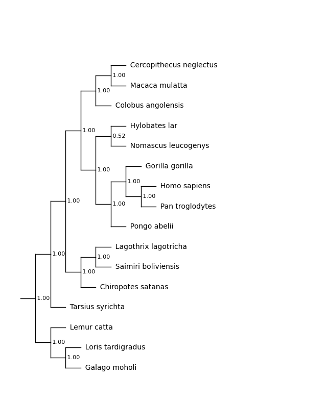
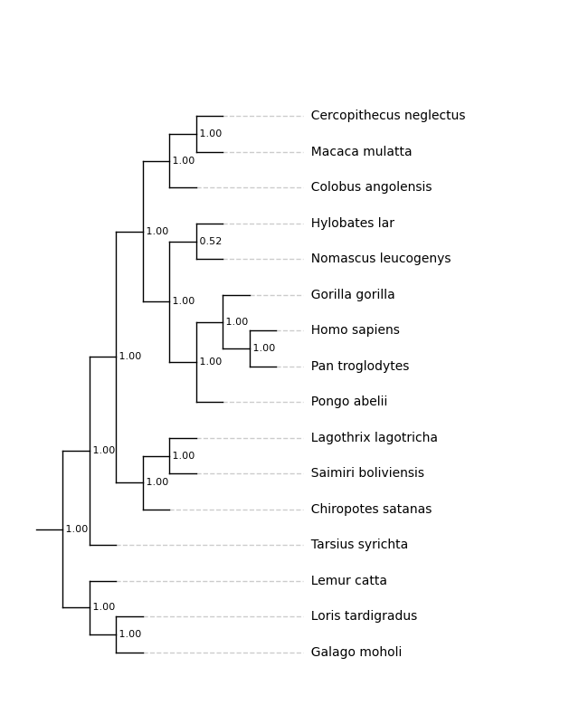
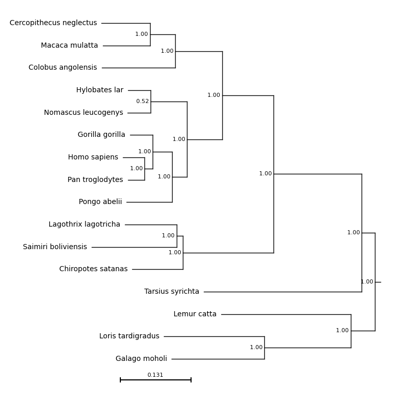
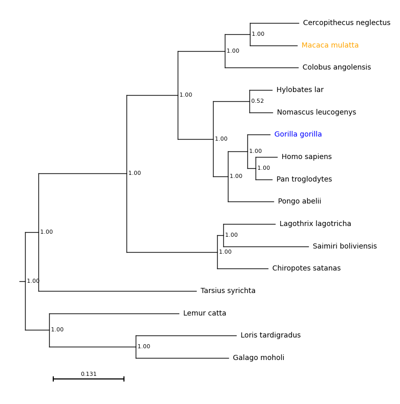
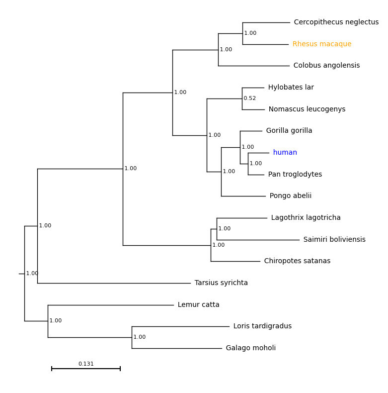

# plot_phylo



This module allows the user to plot a phylogenetic tree on an existing matplotlib axis.

This means that:
* Phylogenies can be incorporated into existing plots.
* Annotations can be added using standard matplotlib functionality.
* Plots can be output in png, pdf, svg or tiff formats.
* Automatically generated and updated figures can include phylogenies

The module depends on the [ETE Toolkit](http://etetoolkit.org/), an existing Python framework for analysing and visualising phylogenetic trees, plus the [matplotlib](https://matplotlib.org/) visualisation library.

The tree used in these examples is from the [10K trees](https://10ktrees.nunn-lab.org/) project and is illustrative only. The secondary tree shown in the detailed example is manually edited and not based on biological data.


## Quick Start

To draw a phylogeny under the default settings onto a blank figure.

```
import matplotlib.pyplot as plt
import plot_phylo

# Create an empty plot, 8in (width) by 10in (height) - matplotlib
f = plt.figure(figsize=(8, 10))

# Add an axis - matplotlib
ax = plt.subplot()

# Plot the tree on this axis, using the default settings - plot_phylo
results = plot_phylo.plot_phylo("examples/primates.nw", ax)

# Save the tree - matplotlib
plt.savefig("examples/basic_plot.png", bbox_inches='tight')
```

The output of this function is:


## Adding matplotlib Elements
One of the main advantages of this module is that, as plots are generated using matplotlib and added to an active axis, other elements of matplotlib plots can be incorporated - the plot remains activate and can be edited.

The plot_phylo function returns a dictionary where the keys are the tip labels and the values are the boundaries of the text boxes containing the tip labels, in axis units. 

For example, the first few items in the list returned from the function call above are as follows:


```
{'Cercopithecus neglectus': {'index': 0,
  'xmin': 9.656,
  'xmax': 16.336,
  'ymin': 9.882,
  'ymax': 10.118,
  'ymid': 10.0,
  'xmid': 12.883},
 'Macaca mulatta': {'index': 1,
  'xmin': 9.609,
  'xmax': 14.2,
  'ymin': 9.215,
  'ymax': 9.452,
  'ymid': 9.333,
  'xmid': 12.101},
 'Colobus angolensis': {'index': 2,
  'xmin': 9.649,
  'xmax': 15.016,
  'ymin': 8.548,
  'ymax': 8.785,
  'ymid': 8.667,
  'xmid': 12.883},
...
```

`xmin`, `xmid` and `xmax` are the positions of the left, centre and right of the tip label text on the x-axis.

`ymin`, `ymid` and `ymax` are the positions of the bottom, centre and top of the tip label text on the y-axis.

`ind` is the position of this label on the tree, reading from top to bottom, starting at 0.

For example, for the first list item, Cercopithecus neglectus is the tip label. On the plot, this label spans positions 9.656 to 16.336 on the x-axis and 9.882 to 10.118 on the y axis. It is at position 0 in the tree.


Providing these positions allows the user to add annotations etc. to the tip labels using matplotlib after drawing the plot.

For example, here, the boundary box is of the first tip label is marked on the tree.

```
f = plt.figure(figsize=(8, 10))
a = plt.subplot()

# To use the text positions, the axis limits should be explicitly
# specified before the plot is drawn

plt.xlim(-2, 20)
plt.ylim(-2, 11)

# Draw the tree
results = plot_phylo.plot_phylo("examples/primates.nw", a)

# Retrieve the first result - for C. neglectus
c_neg_results = results['Cercopithecus neglectus']

# Plot these points on the axis
# Bottom left
plt.scatter(c_neg_results['xmin'], c_neg_results['ymin'], color='green', s=15)
# Top left
plt.scatter(c_neg_results['xmin'], c_neg_results['ymax'], color='red', s=15)
# Bottom right
plt.scatter(c_neg_results['xmax'], c_neg_results['ymin'], color='blue', s=15)
# Top right
plt.scatter(c_neg_results['xmax'], c_neg_results['ymax'], color='orange', s=15)

# Save
f.savefig("examples/basic_plot_box.png", bbox_inches='tight')

```


## Positioning the Plot
Using the `xpos`, `ypos`, `height` and `width` parameters, the exact location of the tree within the axis can be specified.

**`xpos`** defines the position of the most ancestral node in the tree on the x-axis, excluding the root. In the example tree, this is the split between the bottom three species (lemur, loris and galago) and the remaining primates.

**`ypos`** defines the position of the bottom branch of the tree, on the y-axis. In the example tree, this is the branch leading to *Galago moholi*.

**`width`** defines the width of the tree, excluding tip labels, in x-axis units. A tree with a `width` of 10 and and `xpos` of 5 will span from positions 5 to 15 on the x axis.

**`height`** defines the height of the tree, excluding tip labels, in y-axis units. A tree with a `height` of 10 and and `ypos` of 5 will span from positions 5 to 15 on the y axis.

For example:

```
# Draw the plot and set the axis limits
f = plt.figure(figsize=(8, 10))
ax = plt.subplot()
ax.set_xlim(0, 60)
ax.set_ylim(0, 20)

# Set values for xpos, ypos, height and width
xpos_val = 25
ypos_val = 10
height_val = 5
width_val = 20

# Run the plot_phylo function with these values
results = plot_phylo.plot_phylo("examples/primates.nw", ax, xpos=xpos_val, ypos=ypos_val, height=height_val, width=width_val, show_axis=True, branch_lengths=False)

# Annotate these points on the tree using matplotlib functions
# Mark the bottom left corner
ax.scatter(xpos_val, ypos_val, color='red', zorder=2)

# Bottom right corner
ax.scatter(xpos_val + width_val, ypos_val, color='blue', zorder=2)

# Top left corner
ax.scatter(xpos_val, ypos_val+height_val, color='green', zorder=2)

# Top right corner
ax.scatter(xpos_val+width_val, ypos_val+height_val, color='orange', zorder=2)

# Draw a box around this region
ax.plot([xpos_val,
         xpos_val+width_val,
         xpos_val+width_val,
         xpos_val,
         xpos_val],
        [ypos_val,
         ypos_val,
         ypos_val+height_val,
         ypos_val+height_val,
         ypos_val], color='lightgrey', zorder=1)

plt.savefig("examples/tree_pos.png", bbox_inches='tight')

```



## Parameters
* **`tree`** (`str`, Required)

	Either the path to a newick formatted tree or a string containing a newick formatted tree. 

* **`ax`** (`matplotlib.axes._axes.Axes`, Required)

	An open matplotlib ax object where the tree will be plotted. Required.

* **`xpos`** (`float`, Default 0)

	Desired position of the root of the tree on the x axis, in axis units. 

* **`ypos`** (`float`, Default 0)

	Desired position of the bottom of the tree on the y axis, in axis units. 

* **`height`** (`float`, Default 10)

	Desired height of the tree, in axis units. Regardless of the height of the axis, the tree with span from `ypos` to `ypos + height`.

* **`width`** (`float`, Default 10)

	Desired width of the tree, in axis units. Default 10.

* **`show_axis`** (`bool`, Default False)
 
	Show the axis lines and ticks on the output tree. 

* **`show_support`** (`bool`, Default False)
	Display branch support on the internal nodes of the tree. 

* **`align_tips`** (`bool`, Default False)

	If True, the tip labels will be horizontally aligned rather than positioned at the tips of the branches. By default, they are left-aligned for a standard tree and right-aligned for a mirrored tree (reverse=True)

With `align_tips=True`
```
f = plt.figure(figsize=(8, 10))
ax = plt.subplot()
results = plot_phylo.plot_phylo("examples/primates.nw", ax, align_tips=True)
plt.savefig("examples/align_tips.png", bbox_inches='tight')
```



* **`rev_align_tips`** (`bool`, Default False)

	If True the tip labels are right-aligned if reverse=False and left-aligned if reverse=True.

With `rev_align_tips=True`

```
f = plt.figure(figsize=(8, 10))
ax = plt.subplot()

# For reverse aligned tip labels the axis limits need to be specified in advance
ax.set_xlim(-1, 12)

results = plot_phylo.plot_phylo("examples/primates.nw", ax, rev_align_tips=True)
plt.savefig("examples/rev_align_tips.png", bbox_inches='tight')
```


* **`branch_lengths`** (`bool`, Default True)

	If True, the branch lengths provided in the tree are used, otherwise all branches are fixed to the same length. The align tips function can be used in the same way regardless of whether branch lengths are used.

With `branch_lengths=False`:

```
f = plt.figure(figsize=(8, 10))

ax = plt.subplot()
ax.set_xlim(-1, 20)
# ylim is set explicitly before drawing the plot
ax.set_ylim(-1, 10)

results = plot_phylo.plot_phylo("examples/primates.nw", ax, branch_lengths=False)

# Save the tree - matplotlib
plt.savefig("examples/nobranchlengths.png", bbox_inches='tight')
```


With `branch_lengths=False` and `align_tips=True`:

```
f = plt.figure(figsize=(8, 10))

ax = plt.subplot()
ax.set_xlim(-1, 20)
# ylim is set explicitly before drawing the plot
ax.set_ylim(-1, 10)

results = plot_phylo.plot_phylo("examples/primates.nw", ax, branch_lengths=False, align_tips=True)

# Save the tree - matplotlib
plt.savefig("examples/nobranchlengths_ali.png", bbox_inches='tight')
```


* **`scale_bar`** (`bool`, Default True)

	If True and branch_lengths is True, draw a scale bar.
 
* **`scale_bar_width`** (`float`, Default None)

	Width of scale bar in axis units. If not specified, the scale bar will be 1/4 of the width of the tree.

* **`reverse`** (`bool`, Default False)
*
	If True, mirror the tree on the y-axis, showing the root on the right-hand side.

With `reverse=True`:

```
f = plt.figure(figsize=(8, 10))
ax = plt.subplot()
results = plot_phylo.plot_phylo("examples/primates.nw", ax, reverse=True)
plt.savefig("examples/reversed.png", bbox_inches='tight')
```



* **`col_dict`** (`dict`, Default {})

	User provided dictionary with tip labels as keys and colours (in any [format accepted by matplotlib](https://matplotlib.org/stable/users/explain/colors/colors.html) as values. If this is not specified all labels will be black, if only some labels are specified all others will be black.

With `col_dict={'Macaca mulatta': 'orange, 'Gorilla gorilla': 'blue'}`:

```
f = plt.figure(figsize=(8, 10))
ax = plt.subplot()
results = plot_phylo.plot_phylo("examples/primates.nw", ax, col_dict={'Macaca mulatta': 'orange', 'Gorilla gorilla': 'blue'})
plt.savefig("examples/colours.png", bbox_inches='tight')
```




* **`label_dict`** (`dict`, Default {})

	User provided dictionary with current tip labels as keys and desired
tip labels as values. If this is not specified all labels will be as specified in the newick, if some labels are specified all others will match the newick.

With `label_dict={'Macaca mulatta': 'Rhesus macaque, 'Homo sapiens': 'human'}`: 

```
f = plt.figure(figsize=(8, 10))
ax = plt.subplot()
results = plot_phylo.plot_phylo("examples/primates.nw", ax, label_dict={'Macaca mulatta': 'Rhesus macaque', 'Homo sapiens': 'human'},
col_dict={'Macaca mulatta': 'orange', 'Homo sapiens': 'blue'})
plt.savefig("examples/labels.png", bbox_inches='tight')
```




* **`font_size`** (`int`, Default 10)

	Font size for tip labels. Branch support and scale bar labels will be two sizes smaller.
 
* **`line_col`** (`str` or `tuple`, Default 'black')

	Line colour, in any [format accepted by matplotlib](https://matplotlib.org/stable/users/explain/colors/colors.html).

* **`line_width`** (`float`, Default 2)

	Line width.

## Detailed Example
This detailed example shows how `plot_phylo` can be combined with matplotlib and basic Python to draw complex plots.

```
# Build the blank figure
f = plt.figure(figsize=(15, 10))
ax = plt.subplot(1, 1, 1)

# Set the x and y axis limits
ax.set_xlim(2, 122)
ax.set_ylim(9, 21)
ypos_val = 10

# Define colours for specific nodes
colours = {'Gorilla gorilla': '#e21c0c', 'Pan troglodytes': '#0c57e2', 'Saimiri boliviensis': '#338c3e',
           'Chiropotes satanas': '#dc9d0c'}

# Draw the left tree
results_left = plot_phylo.plot_phylo("primates.nw",
                                      ax, xpos=5, ypos=ypos_val, width=15,
                                      show_axis=False, show_support=False,
                                      font_size=16, col_dict=colours,
                                      rev_align_tips=True)

# Draw the right tree
results_right = plot_phylo.plot_phylo("primates_mixed.nw",
                                       ax, xpos=105, ypos=10, width=15,
                                       show_axis=False, show_support=False,
                                       reverse=True,
                                       font_size=16, col_dict=colours,
                                       rev_align_tips=True)

# Using matplotlib and basic Python functionality on the returned dictionaries from hereforward

# Connection between trees

# Find the labels which differ between trees
links = []
for r1 in results_left:
    # Find the index of each label in the tree
    ind1 = results_left[r1]['index']
    ind2 = results_right[r1]['index']
    
    # If they differ, store them
    if ind1 != ind2:
        links.append(r1)

for link in links:
    # Retrieve the positions of the non-matched labels
    left_box = results_left[link]
    right_box = results_right[link]
    
    # Get the position of the labels in each tree
    left_x = left_box['xmax'] + 1
    left_y = left_box['ymid']
    
    right_x = right_box['xmin'] - 1
    right_y = right_box['ymid']

    # Plot the points on the left tree
    ax.scatter(left_x, left_y, color=colours[link])
    
    # Plot the points on the right tree
    ax.scatter(right_x, right_y, color=colours[link])
    
    # Connect the two points
    ax.plot([left_x, right_x], [left_y, right_y], color=colours[link])

# Box highlighting great apes
# Define which species are great apes
great_apes = ['Gorilla gorilla', 'Pan troglodytes', 'Homo sapiens', 'Pongo abelii']
ga_pos = []

# Store the positions of the great ape labels
for nam, box in results_left.items():
    if nam in great_apes:
        ga_pos.append(box['ymin'])
        ga_pos.append(box['ymax'])

# Draw the grey box. 15.5 is based on visually inspecting the axis.
ax.fill_between([15.5, box['xmax']], min(ga_pos), max(ga_pos), color='lightgrey')

# Additional labels
# Add the Tree 1 and Tree 2 labels, using figure co-ordinates
f.text(0.2, 0.85, 'Tree 1', ha='center', fontsize=16, fontweight='bold')
f.text(0.8, 0.85, 'Tree 2', ha='center', fontsize=16, fontweight='bold')

# Add the overall title
f.suptitle("Primate Phylogeny", fontsize=24, y=0.92)

# Save
f.savefig("examples/layered.png", bbox_inches='tight')
```


