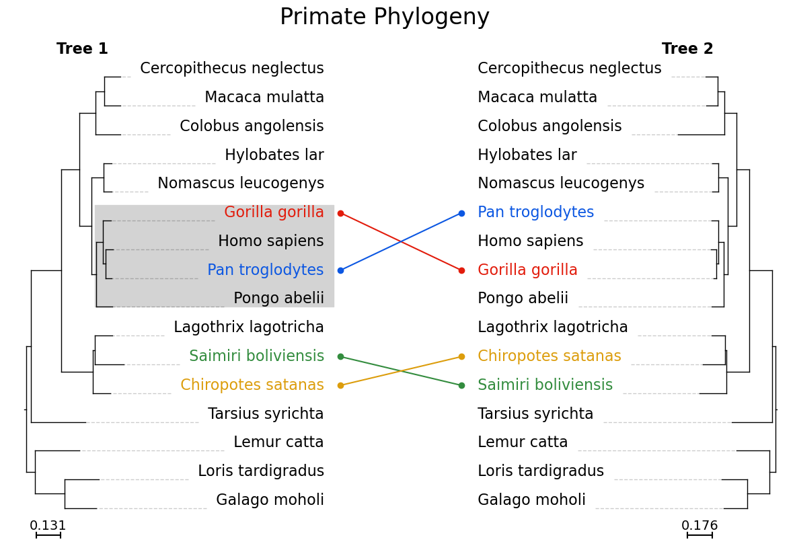

# plot_phylo

This module allows the user to plot a phylogenetic tree on an existing matplotlib axis.

This means that:
* Phylogenies can be incorporated into existing plots.
* Annotations can be added using standard matplotlib functionality.
* Plots can be output in png, pdf, svg or tiff formats.
* Automatically generated and updated figures can include phylogenies

1. [Installation](pages/installation.md)
2. [Quick Start](pages/quickstart.md)
3. [Parameters](pages/parameters.md)
4. [Incorporating Matplotlib Elements](pages/matplotlib.md)
5. [Functions](pages/functions.html)
6. [Detailed Example](pages/detailed.md)

The module depends on the [ETE Toolkit](http://etetoolkit.org/), an excellent existing Python framework for analysing and visualising phylogenetic trees, plus the [matplotlib](https://matplotlib.org/) visualisation library.
