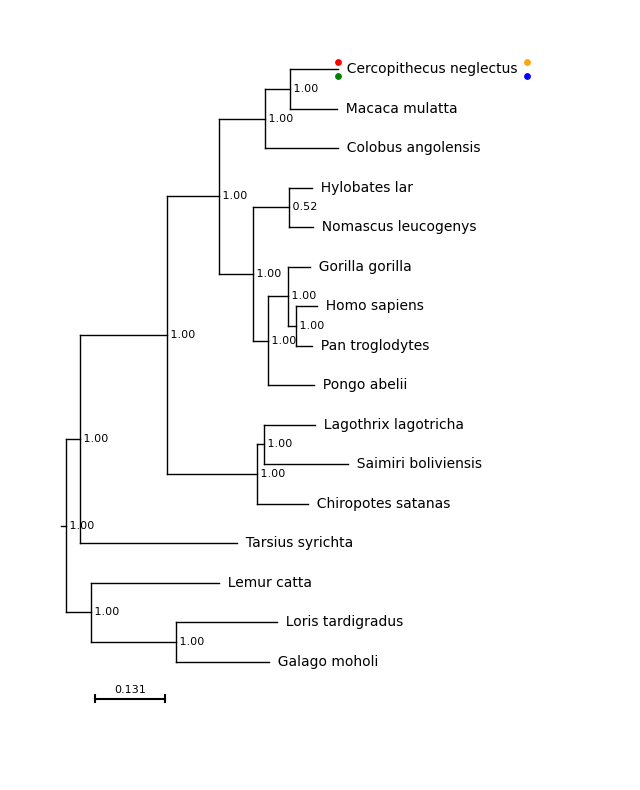

# Adding Matplotlib Elements to your Tree
One of the main advantages of this module is that, as plots are generated using matplotlib and added to an active axis, other elements of matplotlib plots can be incorporated - the plot remains activate and can be edited.

The plot_phylo function returns a dictionary where the keys are the tip labels and the values are the boundaries of the text boxes containing the tip labels, in axis units. 

For example, the first few items in the list returned from the function call above are as follows:


```
{'Cercopithecus neglectus': {'index': 0,
  'xmin': 9.656,
  'xmax': 16.336,
  'ymin': 9.882,
  'ymax': 10.118,
  'ymid': 10.0,
  'xmid': 12.883},
 'Macaca mulatta': {'index': 1,
  'xmin': 9.609,
  'xmax': 14.2,
  'ymin': 9.215,
  'ymax': 9.452,
  'ymid': 9.333,
  'xmid': 12.101},
 'Colobus angolensis': {'index': 2,
  'xmin': 9.649,
  'xmax': 15.016,
  'ymin': 8.548,
  'ymax': 8.785,
  'ymid': 8.667,
  'xmid': 12.883},
...
```

`xmin`, `xmid` and `xmax` are the positions of the left, centre and right of the tip label text on the x-axis.

`ymin`, `ymid` and `ymax` are the positions of the bottom, centre and top of the tip label text on the y-axis.

`ind` is the position of this label on the tree, reading from top to bottom, starting at 0.

For example, for the first list item, Cercopithecus neglectus is the tip label. On the plot, this label spans positions 9.656 to 16.336 on the x-axis and 9.882 to 10.118 on the y axis. It is at position 0 in the tree.


Providing these positions allows the user to add annotations etc. to the tip labels using matplotlib after drawing the plot.

For example, here, the boundary box is of the first tip label is marked on the tree.

```
f = plt.figure(figsize=(8, 10))
a = plt.subplot()

# To use the text positions, the axis limits should be explicitly
# specified before the plot is drawn

plt.xlim(-2, 20)
plt.ylim(-2, 11)

# Draw the tree
results = plot_phylo.plot_phylo("examples/primates.nw", a)

# Retrieve the first result - for C. neglectus
c_neg_results = results['Cercopithecus neglectus']

# Plot these points on the axis
# Bottom left
plt.scatter(c_neg_results['xmin'], c_neg_results['ymin'], color='green', s=15)
# Top left
plt.scatter(c_neg_results['xmin'], c_neg_results['ymax'], color='red', s=15)
# Bottom right
plt.scatter(c_neg_results['xmax'], c_neg_results['ymin'], color='blue', s=15)
# Top right
plt.scatter(c_neg_results['xmax'], c_neg_results['ymax'], color='orange', s=15)

# Save
f.savefig("examples/basic_plot_box.png", bbox_inches='tight')

```


