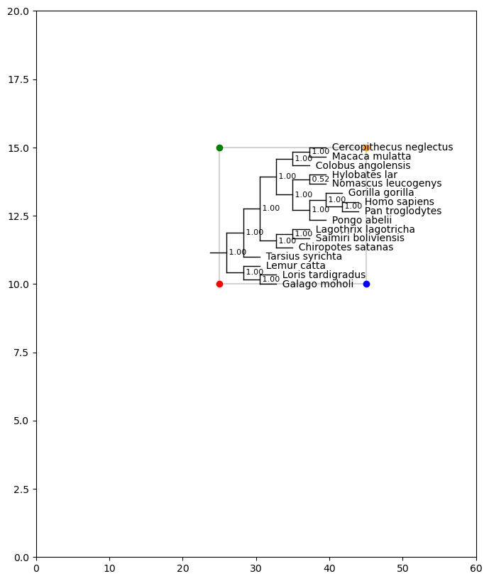
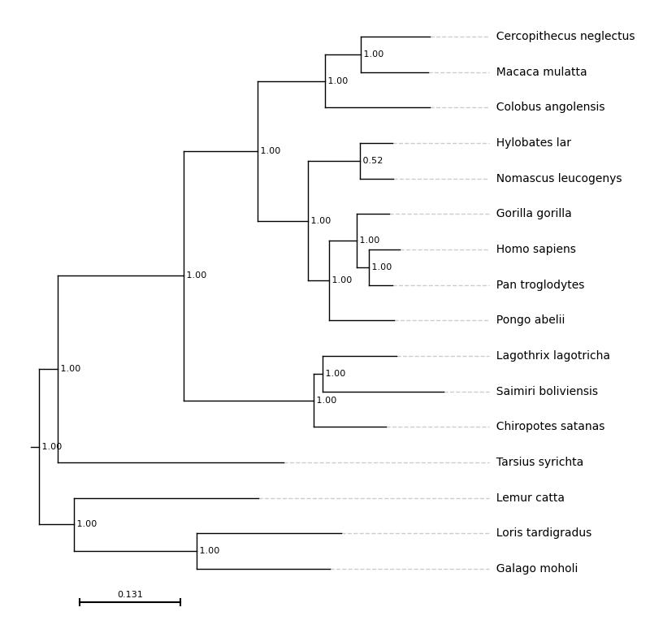
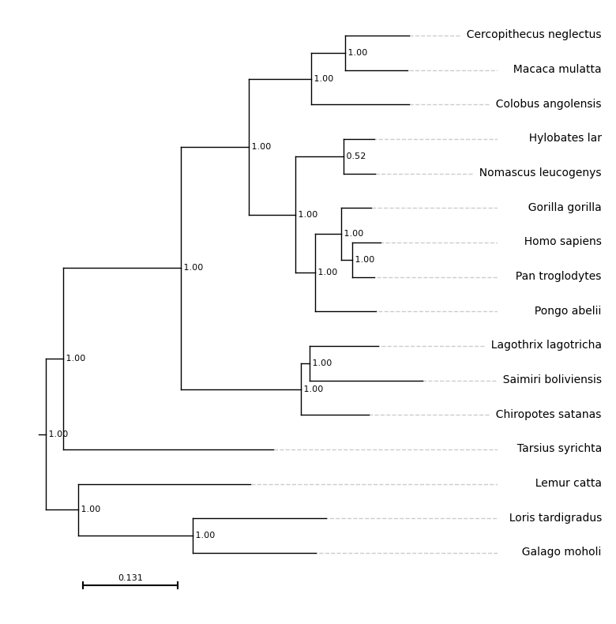
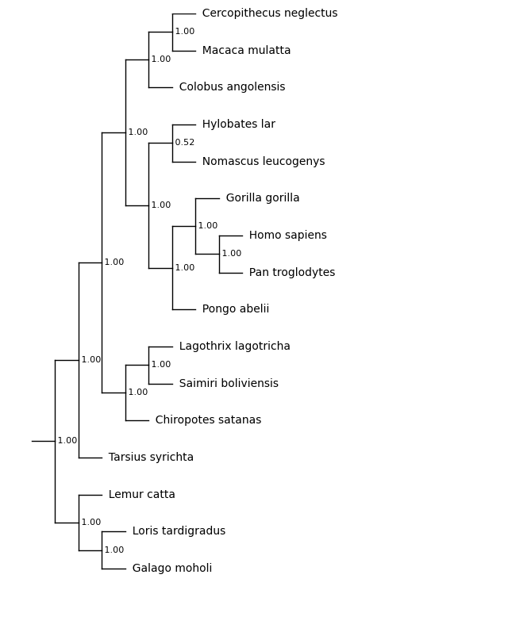
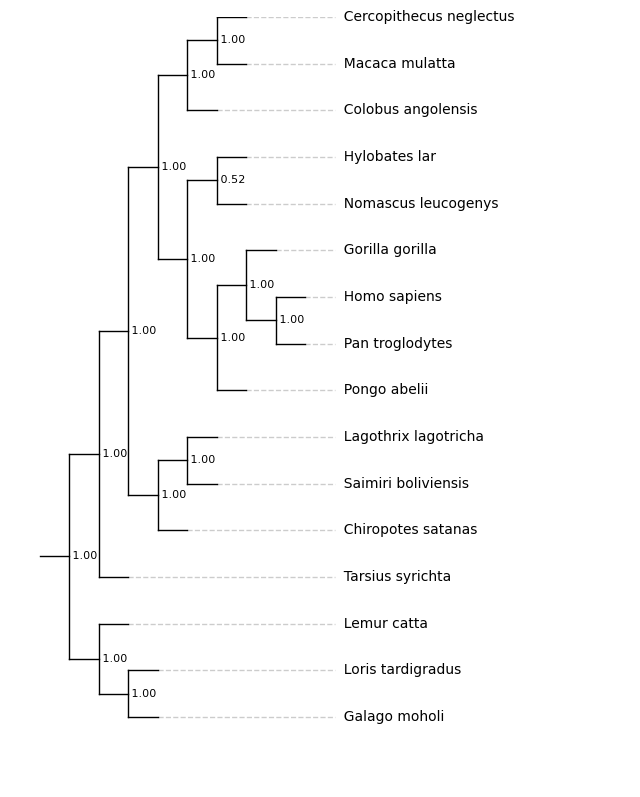
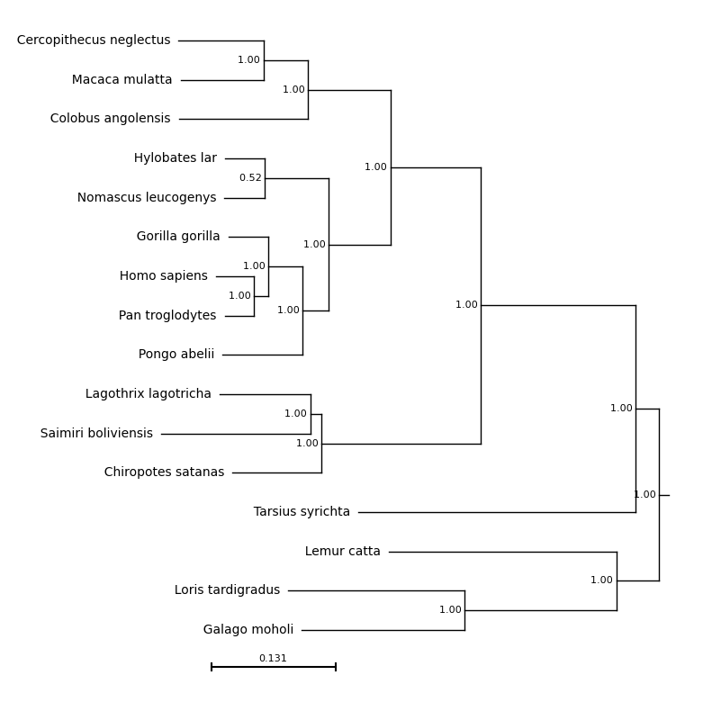
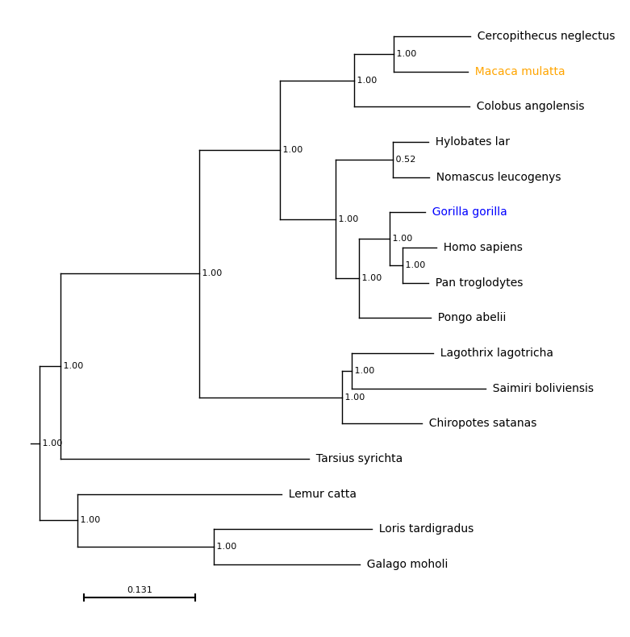
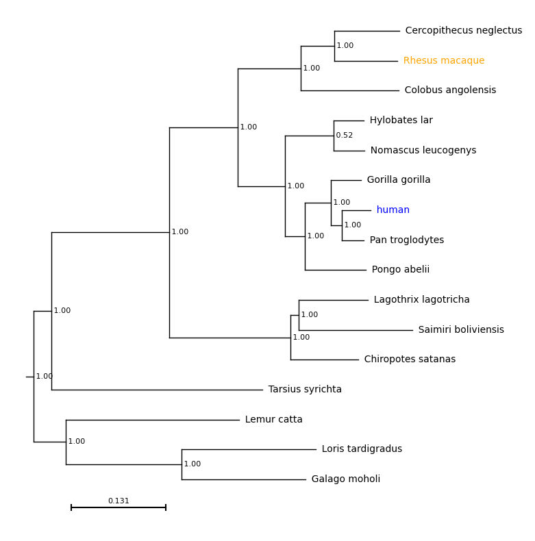
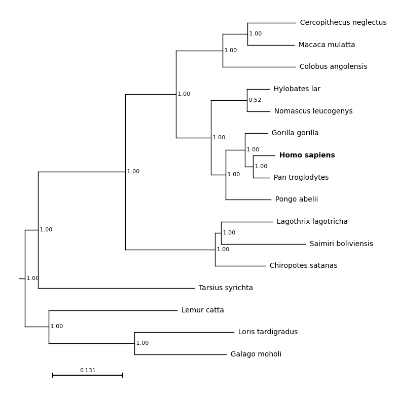

# Parameters

Detailed descriptions of all parameters are provided below.


*Required*

* [tree](#tree) - tree file
* [ax](#ax) - matplotlib axis

*Positioning the plot on the axis*

* [xpos](#xpos) - x-axis position
* [ypos](#ypos) - y-axis position
* [height](#height) - tree height
* [width](#width) - tree width

*Visualisation options*

* [show_axis](#show-axis) - show x and y axis on plot
* [show_support](#show-support) - show branch support
* [align_tips](#align-tips) - left align tip labels
* [rev_align_tips](#rev-align-tips) - right align tip labels 
* [branch_lengths](#branch-lengths) - scale branch lengths
* [scale_bar](#scale-bar) - show scale bar
* [scale_bar_width](#scale-bar-width) - set scale bar width
* [reverse](#reverse) - mirror the tree, show root on right side
* [outgroup](#outgroup) - set the outgroup
* [col_dict](#col-dict) - set tip label colours
* [label_dict](#label-dict) - relabel tips
* [font_size](#font-size) - set font size
* [line_col](#line-col) - set line colour
* [line_width](#line-width) - set line width
* [bold](#bold) - highlight tip labels in bold

## Required
### `tree`
(`str`, Required)

Either the path to a newick formatted tree or a string containing a newick formatted tree. 

### `ax`
(`matplotlib.axes._axes.Axes`, Required)

An open matplotlib ax object where the tree will be plotted. Required.

## Positioning the Plot
Using the `xpos`, `ypos`, `height` and `width` parameters, the exact location of the tree within the axis can be specified.

**`xpos`** defines the position of the most ancestral node in the tree on the x-axis, excluding the root. In the example tree, this is the split between the bottom three species (lemur, loris and galago) and the remaining primates.

**`ypos`** defines the position of the bottom branch of the tree, on the y-axis. In the example tree, this is the branch leading to *Galago moholi*.

**`width`** defines the width of the tree, excluding tip labels, in x-axis units. A tree with a `width` of 10 and and `xpos` of 5 will span from positions 5 to 15 on the x axis.

**`height`** defines the height of the tree, excluding tip labels, in y-axis units. A tree with a `height` of 10 and and `ypos` of 5 will span from positions 5 to 15 on the y axis.

For example:

```
# Draw the plot and set the axis limits
f = plt.figure(figsize=(8, 10))
ax = plt.subplot()
ax.set_xlim(0, 60)
ax.set_ylim(0, 20)

# Set values for xpos, ypos, height and width
xpos_val = 25
ypos_val = 10
height_val = 5
width_val = 20

# Run the plot_phylo function with these values
results = plot_phylo.plot_phylo("examples/primates.nw", ax, xpos=xpos_val, ypos=ypos_val, height=height_val, width=width_val, show_axis=True, branch_lengths=False)

# Annotate these points on the tree using matplotlib functions
# Mark the bottom left corner
ax.scatter(xpos_val, ypos_val, color='red', zorder=2)

# Bottom right corner
ax.scatter(xpos_val + width_val, ypos_val, color='blue', zorder=2)

# Top left corner
ax.scatter(xpos_val, ypos_val+height_val, color='green', zorder=2)

# Top right corner
ax.scatter(xpos_val+width_val, ypos_val+height_val, color='orange', zorder=2)

# Draw a box around this region
ax.plot([xpos_val,
         xpos_val+width_val,
         xpos_val+width_val,
         xpos_val,
         xpos_val],
        [ypos_val,
         ypos_val,
         ypos_val+height_val,
         ypos_val+height_val,
         ypos_val], color='lightgrey', zorder=1)

plt.savefig("examples/tree_pos.png", bbox_inches='tight')

```


### `xpos`
(`float`, Default 0)

Desired position of the root of the tree on the x axis, in axis units. 

### `ypos`
(`float`, Default 0)

Desired position of the bottom of the tree on the y axis, in axis units. 

### `height`
(`float`, Default 10)
Desired height of the tree, in axis units. Regardless of the height of the axis, the tree with span from `ypos` to `ypos + height`.

### `width`
(`float`, Default 10)

Desired width of the tree, in axis units. Default 10.

## Visualisation Options
### `show_axis`
(`bool`, Default False)
 
Show the axis lines and ticks on the output tree. 

### `show_support`
(`bool`, Default False)

Display branch support on the internal nodes of the tree. 

### `align_tips`
(`bool`, Default False)

If True, the tip labels will be horizontally aligned rather than positioned at the tips of the branches. By default, they are left-aligned for a standard tree and right-aligned for a mirrored tree (reverse=True)

With `align_tips=True`
```
f = plt.figure(figsize=(8, 10))
ax = plt.subplot()
results = plot_phylo.plot_phylo("examples/primates.nw", ax, align_tips=True)
plt.savefig("examples/align_tips.png", bbox_inches='tight')
```



### `rev_align_tips`
(`bool`, Default False)

If True the tip labels are right-aligned if reverse=False and left-aligned if reverse=True.

With `rev_align_tips=True`

```
f = plt.figure(figsize=(8, 10))
ax = plt.subplot()

# For reverse aligned tip labels the axis limits need to be specified in advance
ax.set_xlim(-1, 12)

results = plot_phylo.plot_phylo("examples/primates.nw", ax, rev_align_tips=True)
plt.savefig("examples/rev_align_tips.png", bbox_inches='tight')
```


### `branch_lengths`
(`bool`, Default True)

If True, the branch lengths provided in the tree are used, otherwise all branches are fixed to the same length. The align tips function can be used in the same way regardless of whether branch lengths are used.

With `branch_lengths=False`:

```
f = plt.figure(figsize=(8, 10))

ax = plt.subplot()
ax.set_xlim(-1, 20)
# ylim is set explicitly before drawing the plot
ax.set_ylim(-1, 10)

results = plot_phylo.plot_phylo("examples/primates.nw", ax, branch_lengths=False)

# Save the tree - matplotlib
plt.savefig("examples/nobranchlengths.png", bbox_inches='tight')
```


With `branch_lengths=False` and `align_tips=True`:

```
f = plt.figure(figsize=(8, 10))

ax = plt.subplot()
ax.set_xlim(-1, 20)
# ylim is set explicitly before drawing the plot
ax.set_ylim(-1, 10)

results = plot_phylo.plot_phylo("examples/primates.nw", ax, branch_lengths=False, align_tips=True)

# Save the tree - matplotlib
plt.savefig("examples/nobranchlengths_ali.png", bbox_inches='tight')
```


### `scale_bar`
(`bool`, Default True)

If True and branch_lengths is True, draw a scale bar.
 
### `scale_bar_width`
(`float`, Default None)

Width of scale bar in axis units. If not specified, the scale bar will be 1/4 of the width of the tree.

### `reverse`
(`bool`, Default False)
*
If True, mirror the tree on the y-axis, showing the root on the right-hand side.

With `reverse=True`:

```
f = plt.figure(figsize=(8, 10))
ax = plt.subplot()
results = plot_phylo.plot_phylo("examples/primates.nw", ax, reverse=True)
plt.savefig("examples/reversed.png", bbox_inches='tight')
```



### `outgroup`
(`str`, Default None)

Specifies a leaf to set as the outgroup, must be identical to the name in the tree file.

### `col_dict`
(`dict`, Default {})

User provided dictionary with tip labels as keys and colours (in any [format accepted by matplotlib](https://matplotlib.org/stable/users/explain/colors/colors.html) as values. If this is not specified all labels will be black, if only some labels are specified all others will be black.

With `col_dict={'Macaca mulatta': 'orange, 'Gorilla gorilla': 'blue'}`:

```
f = plt.figure(figsize=(8, 10))
ax = plt.subplot()
results = plot_phylo.plot_phylo("examples/primates.nw", ax, col_dict={'Macaca mulatta': 'orange', 'Gorilla gorilla': 'blue'})
plt.savefig("examples/colours.png", bbox_inches='tight')
```




### `label_dict`
(`dict`, Default {})

User provided dictionary with current tip labels as keys and desired
tip labels as values. If this is not specified all labels will be as specified in the newick, if some labels are specified all others will match the newick.

With `label_dict={'Macaca mulatta': 'Rhesus macaque, 'Homo sapiens': 'human'}`: 

```
f = plt.figure(figsize=(8, 10))
ax = plt.subplot()
results = plot_phylo.plot_phylo("examples/primates.nw", ax, label_dict={'Macaca mulatta': 'Rhesus macaque', 'Homo sapiens': 'human'},
col_dict={'Macaca mulatta': 'orange', 'Homo sapiens': 'blue'})
plt.savefig("examples/labels.png", bbox_inches='tight')
```




### `font_size`
(`int`, Default 10)

Font size for tip labels. Branch support and scale bar labels will be two sizes smaller.
 
### `line_col`
(`str` or `tuple`, Default 'black')

Line colour, in any [format accepted by matplotlib](https://matplotlib.org/stable/users/explain/colors/colors.html).

### `line_width`
(`float`, Default 2)

Line width.
	
### `bold`
(`list`, Default `[]`)

A list of sequence names to show in bold. If sequences are renamed using `label_dict`, provide the original names.

With `bold=['Homo sapiens']`:
```
f = plt.figure(figsize=(8, 10))
ax = plt.subplot()
results = plot_phylo.plot_phylo("%s/examples/primates.nw" % path, ax, bold=['Homo sapiens'])
plt.savefig("examples/bold.png", bbox_inches='tight')
```
  

