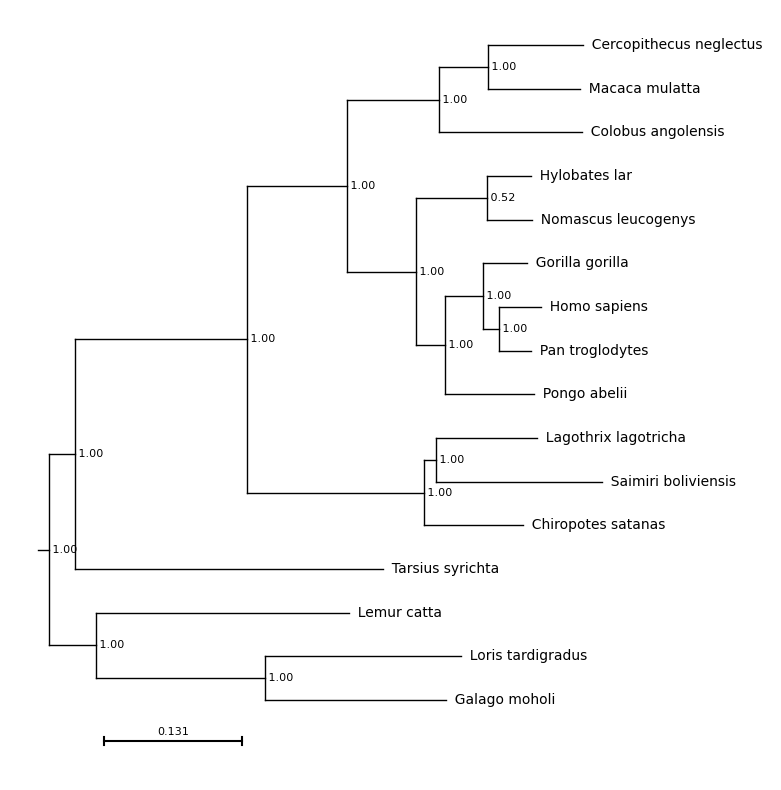

# Quick Start

To draw a phylogeny under the default settings onto a blank figure.

```
import matplotlib.pyplot as plt
import plot_phylo

# Create an empty plot, 8in (width) by 10in (height) - matplotlib
f = plt.figure(figsize=(8, 10))

# Add an axis - matplotlib
ax = plt.subplot()

# Plot the tree on this axis, using the default settings - plot_phylo
results = plot_phylo.plot_phylo("examples/primates.nw", ax)

# Save the tree - matplotlib
plt.savefig("examples/basic_plot.png", bbox_inches='tight')
```

The output of this function is:
